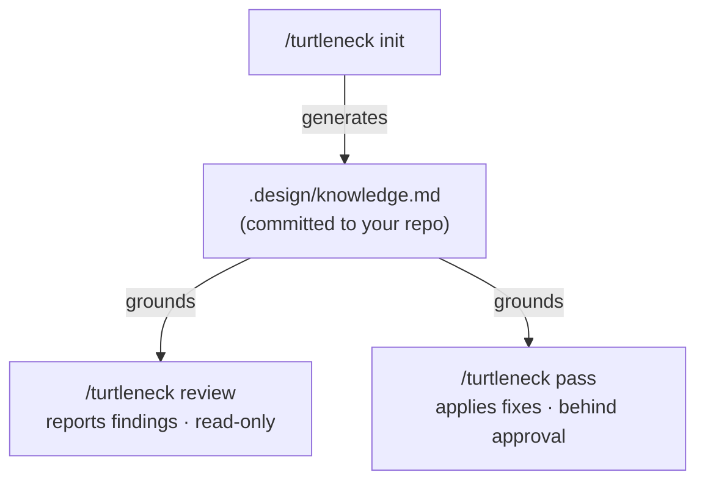

<p align="center">
  
</p>

<h1 align="center">turtleneck</h1>

<p align="center" >
 He reviews the design. Points at what's wrong. Tells you the fix. <br>Disappointment included.
</p>

<hr/>

> This is a **work-in-progress**. The design-critic skill is functional, but the
> project is still in early development. 

A reusable **design-critic capability for coding agents.** Point it at any UI
work — a diff, a component, a screen, a PR — and it reviews that work against
*your project's* design knowledge, and, on request, applies improvements.

Think of it as a senior designer who has seen your `<div>` soup and is choosing,
for now, to remain professional. He won't block your PR. He'll just look at it,
sigh, and tell you which component you were supposed to use.


## FAQ

**What is it?** A slash-command skill that reviews your UI against *your*
project's design system and, on request, fixes it to match.

**What problem does it solve?** Generic AI design feedback ("improve contrast,
add whitespace") is useless — the design-blog horoscope everyone ignores.
turtleneck grounds every note in your actual components, tokens, and principles,
so the advice is specific to your project (and harder to dismiss).

**How do I use it?** Run `/turtleneck init` once to distill your design system
into `.design/knowledge.md`, then `/turtleneck review` on any diff, component, or
screen. `/turtleneck pass` applies the fixes, `/turtleneck explain` tells you
*why* a note stands, and `/turtleneck update` refreshes the artifact when your
design system changes.

**Will it change my code?** Only `pass`, and only after you approve the diff.
`review` just judges from a distance, hands folded.

**Does it block my build or CI?** No. He's disappointed, not a tyrant. It's
advisory — it never gates anything.

**Which agents?** Claude Code and Codex today. It's just Markdown skills, so
adding others should be relatively easy.

## The idea in one picture

The single most important decision: **per-project knowledge is generated; the
critic is fixed and universal.**



`init` distills *your* design system into one Markdown artifact. `review` and
`pass` are written once and reused everywhere; they just consume that artifact.
Only the artifact is per-project — and it lives in **your** repo, diffable and
inspectable, not in a black box.

## One command, five modes

turtleneck is a single slash command with five modes (like `/turtleneck init`).
The read-only modes and the mutating ones share grounding/conservatism rules via a
shared context file, but stay distinct so the read-only / mutate boundary is
explicit.

| Mode | Role | Mutates? |
|------|------|----------|
| `/turtleneck init` | Distill your design system → `.design/knowledge.md`. Run once per project. | Writes the artifact only |
| `/turtleneck update` | Refresh the artifact after your design system changed — merged, preserving confirmed entries. | Artifact only — after approval |
| `/turtleneck review` | Report where UI work diverges from the artifact, with grounded findings. | No — read-only |
| `/turtleneck explain` | Explain *why* a finding, component, token, or principle is what it is — traced to the artifact. | No — read-only |
| `/turtleneck pass` | Review **plus** apply UI improvements, behind a human-approved diff. | Yes — after approval |
| `/turtleneck` | Show the discovery menu. | No |

**Mutate safety:** only `pass` (UI code) and `update` (the artifact) change files,
and the router will only enter them on an explicit, unambiguous `pass` / `update`.
Empty/unknown/ambiguous input shows the menu — it never lands in a mutating mode
by accident, and even then no file is touched before you approve the proposed diff.

## Install

**Easiest — ask your coding agent:**

> Clone https://github.com/mnove/turtleneck and install the turtleneck skill
> into my Claude Code skills directory.

Your agent will clone the repo and symlink `skills/turtleneck` into
`~/.claude/skills/`. Approve the clone/symlink when prompted, then restart Claude
Code. Type `/turtleneck` to confirm it's there.

**Manual (deterministic):**
```sh
git clone https://github.com/mnove/turtleneck.git
ln -sfn "$(pwd)/turtleneck/skills/turtleneck" ~/.claude/skills/turtleneck
```

More options (copy, project-scoped) in
[platforms/claude-code/](platforms/claude-code/).

**On Codex** instead of Claude Code? turtleneck runs natively there too — see
[platforms/codex/](platforms/codex/) for the install (skills go under
`~/.agents/skills/`).

## Updating

**Easiest — ask your agent:**

> Update turtleneck — pull the latest from https://github.com/mnove/turtleneck
> and reinstall the skill.


## Quick start (Claude Code)

1. **Install the skill** (see above), then restart Claude Code.
2. **Generate your design knowledge** — point it at your design system:
   ```
   /turtleneck init
   ```
   Feed it any subset of: a component library, design tokens/theme, a brand or
   style doc, screenshots, blessed example screens. It writes
   `.design/knowledge.md`. **Review the `⚠️ INFERRED — confirm` tags**, then
   commit it.
3. **Review or improve UI** against it:
   ```
   /turtleneck review        # report-only
   /turtleneck pass          # review + apply, behind approval
   ```

## What it is / isn't

**Is:** one agent skill that gives any agent a grounded design-critic ability,
specific to your project.

**Isn't:** a linter, a CI gate, an import-restriction enforcer, or an npm
package. No deterministic enforcement layer. No build is blocked. He critiques;
he does not call security.


## Build

The platform skill folders are **generated** from `src/`, so you edit one source
and every platform stays in sync.

```sh
npm run build      # regenerate skills/turtleneck/ and platforms/codex/turtleneck/
npm run check      # CI-friendly: fail if generated output is stale
```

Edit `src/body/` (router, modes, schema) or `src/platforms.json` (frontmatter,
arg token, output path), then `npm run build`. Adding a platform = one block in
`src/platforms.json`.

## License
MIT. See [LICENSE](LICENSE).

